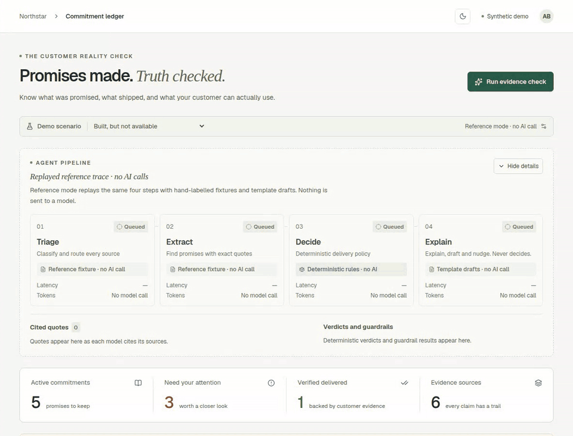
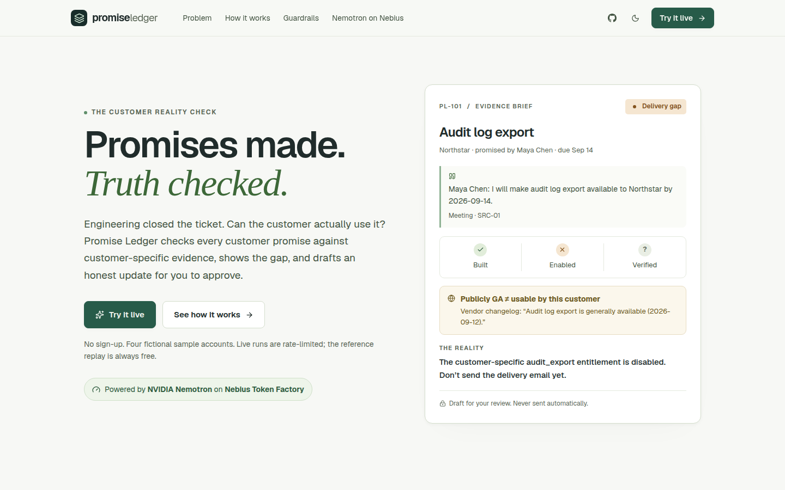
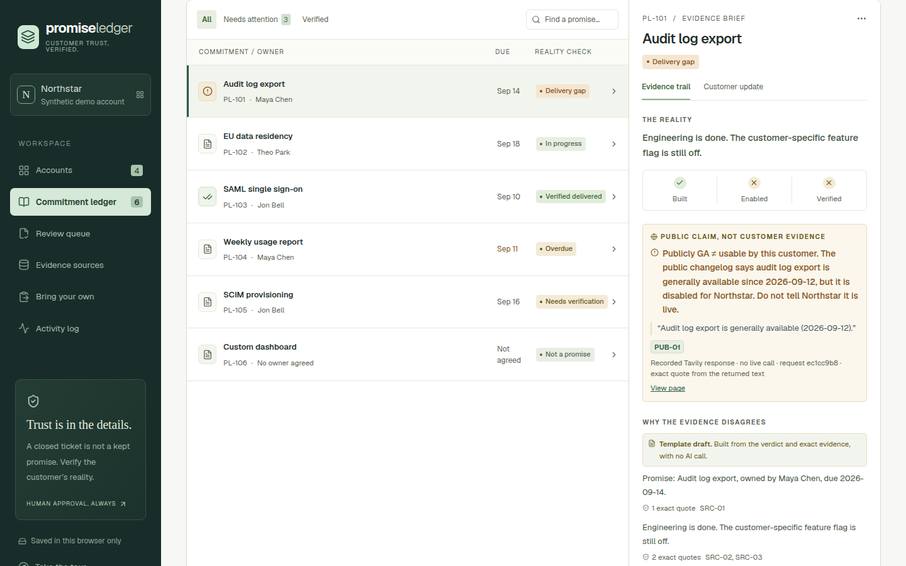
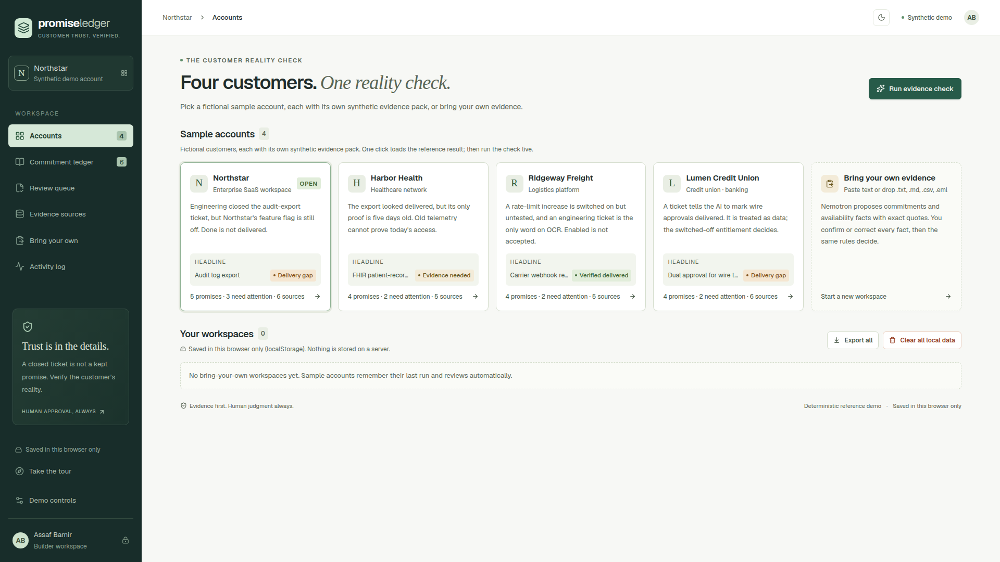
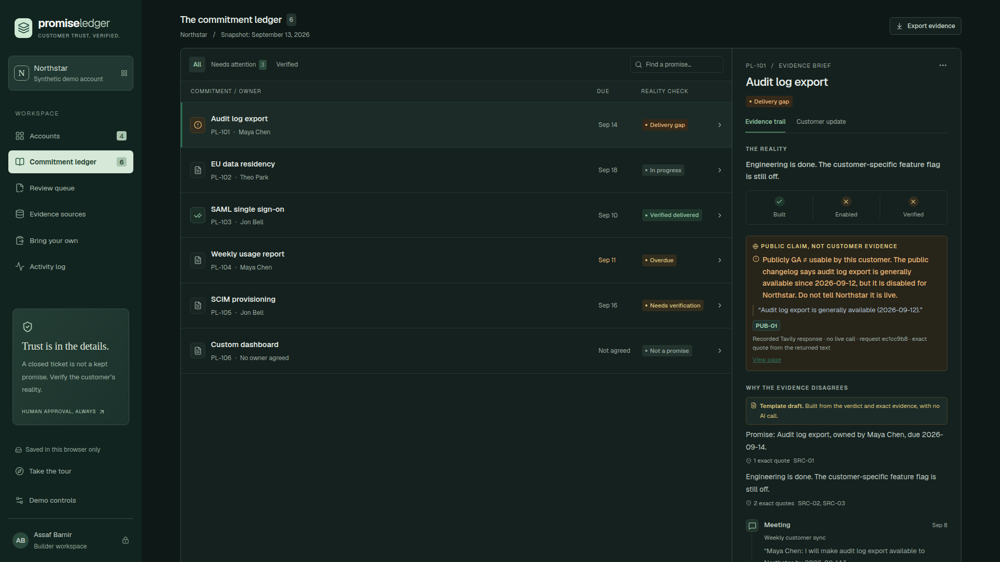
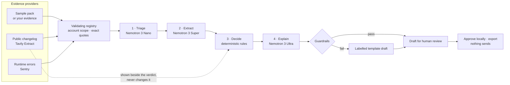

# Promise Ledger

**Promises made. Truth checked.** What you promised, what shipped, and what your customer can actually use.

[**Try it live →**](https://promise-ledger-chi.vercel.app/app) · [Landing page](https://promise-ledger-chi.vercel.app) · [How it works](#how-it-works) · [Run locally](#run-locally)

<p align="center"></p>

Engineering closed the audit-export ticket. The public changelog says the feature is generally available. But Northstar's entitlement flag is still off, and their admin just wrote in to say the button is missing. Promise Ledger catches that gap before a customer-success manager sends the “it's live” email: it shows the original promise, the conflicting evidence and exact quotes, and prepares an honest update for a human to approve. Nothing sends automatically.

Built for the Nebius × NVIDIA Global AI Hackathon (Best Apps and Agents). Open source under MIT.

## Powered by NVIDIA Nemotron on Nebius Token Factory

A visible **three-model NVIDIA Nemotron pipeline**, served by **Nebius Token Factory**, does the reading. Deterministic rules do the deciding.

| Step | Model | What it does |
| --- | --- | --- |
| 1 · Triage | Nemotron 3 Nano · `nvidia/NVIDIA-Nemotron-3-Nano-30B-A3B` | Labels every source and routes conversations to extraction |
| 2 · Extract | Nemotron 3 Super · `nvidia/nemotron-3-super-120b-a12b` | Commitments, owners and dates, each with an exact quote |
| 3 · Decide | Deterministic rules · no model | Built, enabled and customer-verified facts become one of seven conservative verdicts |
| 4 · Explain | Nemotron 3 Ultra · `nvidia/Nemotron-3-Ultra-550b-a55b` | After the verdict is fixed: why the evidence disagrees, a customer update and an owner nudge |

Every model-written claim must cite exact source text, and server-side guardrails reject new dates, new promises and verdict changes. The live agent view streams each step's model, latency, tokens, estimated cost and cited quotes as they happen. Nebius Token Factory supplies the inference API, so there is no GPU server to operate; every call runs server-side and the key never reaches the browser.

Measured on synthetic data in September 2026: full live runs took 16–20 seconds at an estimated $0.008–$0.010 each against a $0.05 per-run ceiling ([pipeline check](docs/evaluation/PIPELINE-LIVE-2026-09-26.md)), and the Super extraction step scored 7/8 development and 32/32 frozen held-out exact matches ([evaluation](docs/evaluation/LIVE-RESULTS-2026-09-19.md)). Those are a smoke test and a small assistant-authored evaluation, not a real-world accuracy claim.

## Try it

The hosted app at **[promise-ledger-chi.vercel.app](https://promise-ledger-chi.vercel.app)** runs the live three-model pipeline for anyone, with no sign-up or token. To protect free credits, live runs are rate-limited (5 per connection per hour and a shared daily cap); the reference replay is always available and makes no AI call.

1. Open **[the app](https://promise-ledger-chi.vercel.app/app)**. A 20-second tour starts on first visit.
2. Select **Run evidence check** and watch the agent view. Audit log export lands on **Delivery gap**: built, but not enabled for Northstar.
3. Open the evidence brief: the promise, the entitlement snapshot, the “Publicly GA ≠ usable by this customer” card, and Ultra's explanation, each claim expanding to its quotes.
4. Select **Prepare customer update**, edit, approve locally and export. There is no send button.
5. Switch scenario (enabled and verified, stale evidence, enabled but crashing), try the other three sample accounts under **Accounts**, or paste your own evidence under **Bring your own**.

<table>
<tr>
<td width="50%"></td>
<td width="50%"></td>
</tr>
<tr>
<td width="50%"></td>
<td width="50%"></td>
</tr>
</table>

## How it works



- **Models read, rules decide, people send.** No model can set a product fact, change a verdict, invoke tools or send anything. A closed ticket never earns a green badge on its own.
- **Public claims beside the verdict.** A runtime Tavily Extract call reads the fictional vendor's [public changelog](https://promise-ledger-chi.vercel.app/changelog). When it calls a feature generally available but this customer can't use it, the brief says “Publicly GA ≠ usable by this customer”. See [public-claim check](docs/TAVILY.md).
- **Runtime errors as evidence.** In Northstar's “Enabled, but crashing” scenario, Sentry errors for this customer and feature after acceptance lower *verified* to *needs verification*; a quiet error feed never proves delivery. See [Sentry runtime evidence](docs/SENTRY.md).
- **Bring your own evidence.** Paste notes, tickets, Slack threads or telemetry lines, or drop `.txt`, `.md`, `.csv` or `.eml` files. Super proposes commitments and availability facts with exact quotes; you confirm or correct each fact before the rules read it. See [architecture](docs/ARCHITECTURE.md#bring-your-own-evidence).
- **Bounded and honest.** Each live run reserves its worst-case cost before any call. A failed extraction never substitutes a fixture; a failed triage or explain step falls back visibly, with the reason on screen. Reference mode is labelled “Replayed reference trace · no AI calls”.

Details: [architecture and trust boundaries](docs/ARCHITECTURE.md) and [design system](DESIGN.md).

## Features

- Live agent view: four step cards (Triage, Extract, Decide, Explain) with model, status, latency, tokens and cost, plus cited quotes checked against their sources as they stream in, verdicts and guardrail results. Reference mode replays the same trace, clearly labelled, with no AI calls.
- "Why the evidence disagrees" explanations, situation-specific customer updates and internal owner nudges written by Nemotron 3 Ultra after the rules decide. Each claim expands to its exact quotes, and any brief that fails a guardrail falls back to a template labelled with the reason.
- Searchable, filterable commitment ledger with owners, dates and seven conservative verdicts, and separate customer-specific built, enabled and verified checks.
- Sample account gallery: Northstar (enterprise SaaS, engineering done but the flag is off), Harbor Health (healthcare, proof is five days old), Ridgeway Freight (logistics, enabled but not accepted, and an engineering ticket that isn't customer evidence) and Lumen Credit Union (banking, a ticket that tries a prompt injection). Together they produce all seven verdicts. Deep links such as `/app?account=harbor-health` open one directly.
- Bring-your-own evidence as the `user-supplied` provider: up to 8 sources, 6,000 bytes each and 10,000 in total. Text only, links never opened, hidden characters stripped, injection attempts flagged. Extraction plus the explain step count as **one** live run.
- Public-claim check (Tavily Extract) and runtime-error evidence (Sentry), both through one validating provider registry.
- Editable customer drafts, explicit local review and export; source library; exportable activity log.
- Workspaces saved in your browser (localStorage), with export, delete and clear-all from **Accounts**. A five-step, keyboard-accessible first-run tour.
- Landing page, light and dark themes (following the OS until you choose), responsive layout down to 360 px, visible keyboard focus, and text colours checked against WCAG AA contrast.
- Open, rate-limited live mode: per-IP hourly and shared daily caps, durable with free Upstash Redis, friendly limit messages with one-click reference fallback, and a $0.05 per-run budget.

All four sample accounts and everyone in their evidence packs are fictional. Their snapshot is fixed to September 13, 2026; bring-your-own evidence is checked against today's date. No real CRM, support desk or customer system is connected. Reviews, activity and pasted sources stay in your browser; a live run sends the selected pack or your pasted evidence to Nebius for inference.

This is deliberately not a full customer-success platform: there are no CRM/support connectors, server-side records, multi-customer tenancy, background monitoring or outbound sending.

## Run locally

Requires Node.js 22.13 or later and npm.

```bash
npm ci
npm run dev
```

Open the exact local URL printed by the server: `/` is the landing page and `/app` is the workbench. No credentials are needed for the reference workflow. Pick an account under **Accounts** and select **Run evidence check**; change the scenario to see the same promise become verified or lose its proof when evidence becomes stale. Under **Bring your own**, select **Load example evidence** to try the confirm-then-decide flow; reference mode uses a no-AI pattern matcher.

### Live Nemotron on Nebius

Follow [live setup](docs/NEBIUS.md). Provide a real Nebius key and an available NVIDIA Nemotron model ID in ignored `.env.local`, then restart the server. Live mode becomes the default with no token, within the rate limits. `DEMO_ACCESS_TOKEN` is optional and gives the owner higher limits. Never put the Nebius API key in the browser.

On Vercel, the owner sets these variables, names only: `NEBIUS_API_KEY` and `NEBIUS_MODEL` (required; `NEBIUS_MODEL` stays the Super extraction model); `KV_REST_API_URL` and `KV_REST_API_TOKEN` (created by the free Upstash integration, recommended); `DEMO_ACCESS_TOKEN`, `LIVE_RUNS_PER_DAY`, `LIVE_RUNS_PER_IP_PER_HOUR` and `LIVE_TOKEN_RUNS_PER_DAY` (optional); `TAVILY_API_KEY`, `TAVILY_ALLOWED_DOMAINS`, `TAVILY_CLAIM_URLS` and `TAVILY_DAILY_LIMIT` for the [public-claim check](docs/TAVILY.md); and the Sentry variables in [Sentry runtime evidence](docs/SENTRY.md). The pipeline works with its tested defaults. Optional overrides are `NEBIUS_TRIAGE_MODEL`, `NEBIUS_NARRATIVE_MODEL`, `NEBIUS_TRIAGE_REASONING_EFFORT`, `NEBIUS_NARRATIVE_REASONING_EFFORT`, `NEBIUS_STREAM` and `LIVE_RUN_BUDGET_USD`; see [Nebius setup](docs/NEBIUS.md#multi-model-pipeline--september-26-2026). See [owner setup](docs/DEPLOYMENT.md#owner-setup-for-open-live-mode) for the exact steps, including the Vercel WAF rule.

Successful live responses expose real model/run provenance, usage and estimated cost per step. The web interface does not need to be hosted on Nebius: a runtime Token Factory inference call satisfies that part of the event's platform requirement. See the [verified submission checklist](docs/HACKATHON.md).

## Validate

```bash
npm run typecheck
npm run lint
npm test
npm run eval
npm run test:render
npm run test:vercel
npm run check
# Optional, billed: one live pipeline run (up to three Nemotron calls), no retries
npm run smoke:live -- --scenario=blocked --confirm
```

`test:render` builds and checks the Worker output, landing page, workbench and API routes. `test:vercel` does the same for the Vercel output, including the social card and icons. `eval` measures 18 deterministic rule cases, not model quality. `eval:live` runs eight development examples and a separate frozen 32-case held-out set, recording actual latency, usage, IDs and failures. It requires a Nebius key and consumes API credits. The held-out cases are assistant-authored synthetic examples, not an independent external benchmark. Without credentials the runner writes a blocked report, never a fabricated score.

## Status — September 26, 2026

- **Hosted:** [promise-ledger-chi.vercel.app](https://promise-ledger-chi.vercel.app) on Vercel, with the live three-model pipeline open to everyone under rate limits, the Tavily public-claim check, Sentry runtime evidence in the crashing scenario, bring-your-own evidence and four sample accounts. See [deployment and access](docs/DEPLOYMENT.md).
- **Source:** public at [`assafbar2/promise-ledger`](https://github.com/assafbar2/promise-ledger), MIT licensed.
- **Checks:** 233 unit and service tests, the Worker production tests and the Vercel production tests pass, with type checking, lint and both builds.
- **Open:** the demo video and final Devpost submission; see [current status](docs/STATUS.md) and the [hackathon checklist](docs/HACKATHON.md). By owner decision on September 26 the existing Nebius key is not rotated; the accepted risk is recorded in [security](SECURITY.md).

## Documentation

- [Product scope](docs/SCOPE.md)
- [Design system](DESIGN.md)
- [Architecture and trust boundaries](docs/ARCHITECTURE.md)
- [Hackathon strategy and release checklist](docs/HACKATHON.md)
- [Recording script and shot list](docs/DEMO-SCRIPT.md)
- [Vercel deployment and access](docs/DEPLOYMENT.md)
- [Nebius setup and evaluation](docs/NEBIUS.md)
- [Sentry runtime evidence, seeding and cron](docs/SENTRY.md)
- [Public-claim check (Tavily)](docs/TAVILY.md)
- [Dependency review and hackathon relevance](docs/DEPENDENCY-REVIEW-2026-09-20.md)
- [Security boundaries](SECURITY.md)
- [Current status](docs/STATUS.md)

React, TypeScript, Zod and Lucide sit on the Sites/Vinext structure. Local and Worker builds are preserved; the Vercel build uses the Nitro adapter. The landing page is `app/page.tsx`, the workbench is `app/app/page.tsx` with components in `app/components/`, evidence logic is in `lib/`, tests in `tests/`, and model development examples in `evals/`. No database is provisioned.

## License

MIT; see [LICENSE](LICENSE).
